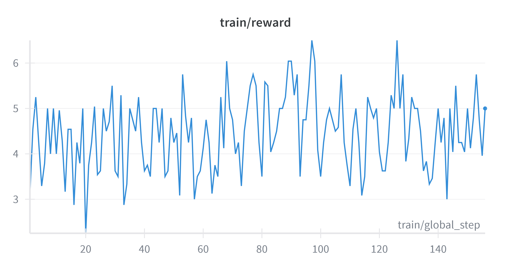

<p align="center">
    
</p>

# MinesweeperGPT

MinesweeperGPT is a research project focused on teaching the Qwen 4B large language model to play Minesweeper using GRPO (Generalized Reinforcement Policy Optimization) finetuning and QLoRA (Quantized Low-Rank Adapter) techniques. The project provides a modular pipeline for data generation, model training, and evaluation, enabling scalable experimentation with LLM-based solvers for the classic Minesweeper game.

## Features

- **LLM Minesweeper Solver:** Integrates Qwen 4B as the core model for learning Minesweeper strategies.
- **GRPO Finetuning with QLoRA:** Combines Generalized Reinforcement Policy Optimization (GRPO) and QLoRA adapters for efficient, reinforcement learning-based policy optimization.
- **Custom Data Generation:** Scripts for generating Minesweeper game data for training and testing.
- **Evaluation Tools:** Utilities for benchmarking model performance on unseen Minesweeper boards.

## Project Structure

```
src/
  datagen/         # Data generation scripts and visualization tools
  finetuning/      # GRPO, QLoRA, and dataset handling modules
  minesweeper/     # Game logic, board representation, and solver interface
  globals.py       # Global configuration and constants
  models.py        # Model loading and management
  utils.py         # Utility functions
main.py            # Entry point for running experiments
README.md          # Project documentation
```

## Getting Started

### 1. **Install Dependencies**

Requires CUDA 12.4+ and Linux for the vLLM backend and finetuning, with at least 15 GB VRAM.

```bash
export PYTHONPATH=.
uv venv
source .venv/bin/activate # .venv\Scripts\activate on windows cmd
uv pip install -qqq torch==2.6.0 torchvision==0.21.0 torchaudio==2.6.0 --index-url https://download.pytorch.org/whl/cu124
uv pip install -qqq unsloth==2025.6.2 unsloth_zoo==2025.6.1 trl==0.18.1 vllm==0.8.5.post1 xformers==0.0.29.post2 triton==3.2.0 accelerate==1.7.0 transformers==4.51.3 torchao==0.12.0 wandb pytest
```

### 2. **Prepare Data**
Use scripts in `src/datagen/` to generate or preprocess Minesweeper game data.

### 3. **Finetune Qwen 4B**

Run GRPO finetuning with QLoRA adapters using notebooks in `src/finetuning/`.

Here is a sample rewards graph using Wandb for finetuning:


### 4. **Test and Evaluate the Model**
For LLM evaluation, use the notebook `tests/finetuning/MinesweeperGPT_test.ipynb` to compare the finetuned model against the base model.

Using my trained model locally:
```python
max_seq_length = 512  # Can increase for longer reasoning traces
lora_rank = 32         # Larger rank = smarter, but slower

# Load model + tokenizer with vLLM acceleration
model, tokenizer = FastLanguageModel.from_pretrained(
    model_name = "unsloth/Qwen3-4B",
    max_seq_length = max_seq_length,
    load_in_4bit = True,       # False for LoRA 16bit
    fast_inference = True,      # Enable vLLM fast inference
    max_lora_rank = lora_rank,
    gpu_memory_utilization = 0.45, # Reduce if out of memory
)

model = FastLanguageModel.get_peft_model(
    model,
    r=lora_rank,  # Choose any number > 0 ! Suggested 8, 16, 32, 64, 128
    target_modules=[
        "q_proj",
        "k_proj",
        "v_proj",
        "o_proj",
        "gate_proj",
        "up_proj",
        "down_proj",
    ],  # Remove QKVO if out of memory
    lora_alpha=lora_rank*2,
    use_gradient_checkpointing="unsloth",  # Enable long context finetuning
    random_state=3407,
)

from huggingface_hub import snapshot_download
from src.finetuning.llmtester import LLMTester

# Download the repo contents into a local folder
local_dir = snapshot_download("adi-256/minesweepergpt")
print(local_dir)

# Now load from local path
lora_request = model.load_lora(local_dir)

# base model
print("Base Model:")
llm_tester = LLMTester(model, tokenizer, test_dataset.select(range(100)))
llm_tester.test_llm(verbose=False)
# finetuned model
print("Finetuned Model:")
llm_tester = LLMTester(model, tokenizer, test_dataset.select(range(100)), lora_request=lora_request)
llm_tester.test_llm(verbose=False)
```

Output:
```bash
Base Model:
Moves correct: 51/100
Moves incorrect: 49/100

Finetuned Model:
Moves correct: 58/100
Moves incorrect: 42/100
```

## Key Files

- `src/finetuning/MinesweeperGPT.ipynb`: Main script for GRPO finetuning with QLoRA.
- `tests/finetuning/MinesweeperGPT_test.ipynb`: Main evaluation script for testing finetuned model against base model.
- `src/datagen/datagen.py`: Data generation for Minesweeper games.

## Citation

If you use this project in your research, please cite or acknowledge the repository.

## License

This project is licensed under the MIT License.

---

For questions or contributions, please open an issue or pull request.
